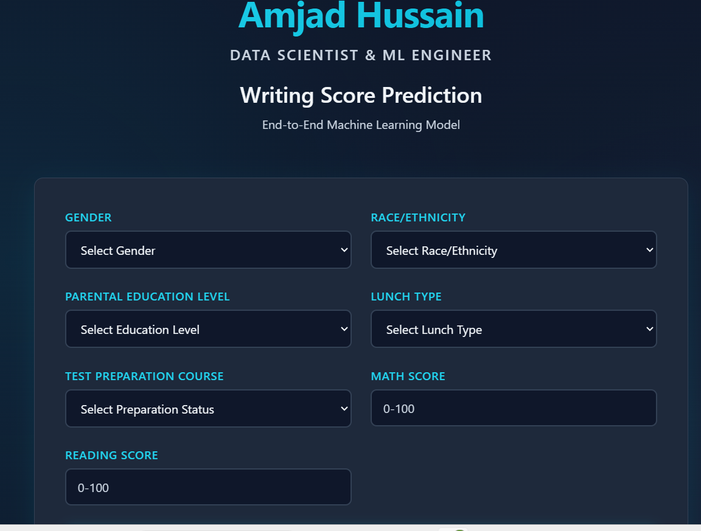
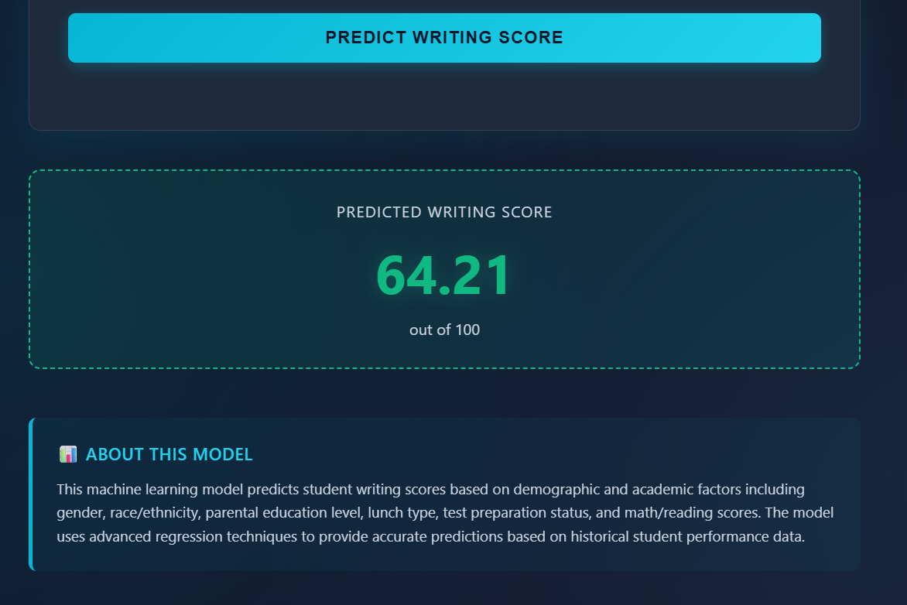

# End-to-End Machine Learning Project: Writing Score Prediction


### *An end-to-end machine learning project that predicts writing score using supervised Regression learning. The project follows a production-ready architecture with Docker, CI/CD, AWS deployment. And The entire project is build using python version 3.13.5*

## **live Demo** 
### No live demo is present, see Deployment Status below for why, but you can pull and run the full app locally in one command using docker:
- to pull docker image from docker hub use [docker pull engrabuhassan/mlproject:v2]
- and to run in local environment use [docker run -p 8080:8080 engrabuhassan/mlproject:v2]
- and then run **http://localhost:8080** for home page and for prediction **http://localhost:8080/prediction**

## **Table of Contents**
1. Problem Statement
2. Dataset
3. Tech Stack
4. Project Architecture
5. Model Performance
6. Deployment Status
7. Screenshots
8. Installation & Local Setup
9. Usage / API
10. CI/CD Pipeline
11. Future Improvements
12. Author

## **Problem Statement**

Educators often lack early, data driven information to identify students who may need additional academic support. This project builds a regression model that predicts a student's writing score based on demographic and academic features (gender, parental education level, lunch type, test preparation course, math and reading score). The goal is to demonstrate a full production ML lifecycle  from raw data to a deployed, containerized web application rather than just a notebook experiment.

## **DataSet**
- Source: Kaggle "Students Performance in Exams" dataset — https://www.kaggle.com/datasets/spscientist/students-performance-in-exams
- Size: 8 x 1000
- Features: gender, race/ethnicity, parental level of education, lunch, test preparation course, math score, reading score
- Target variable: writing score


## **Tech Stack**

| Category         | Technology               |
| ---------------- | -------------------      |
| Language         | Python                   |
| ML               | Scikit-Learn             |
| Data Handling    | Pandas, Numpy            |
| Visualization    | Matplotlib, Seaborn      |
| Web Framework    | Flask                    |
| Frontend         | HTML/CSS                 |
| Containerization | Docker                   |
| Cloud            | AWS                      |
| CI/CD            | GitHub Actions           |
| ContainerRegistry| Amazon ECR               |
| Deployment       | EC2,ECR,Elastic BeanStalk|
| Version Control  | Git  & GitHub            |


## **Project Architecture**

### **Overview**
The project follows a modular, end-to-end machine learning pipeline architecture designed for scalability, reproducibility, and deployment. The system is built using Python and follows industry best practices for machine learning projects.

### **Components**
1. **Data Ingestion**: Responsible for loading the raw data from the source (CSV file) and splitting it into training and testing datasets.
2. **Data Transformation**: Handles data cleaning, feature engineering, and preprocessing steps such as encoding categorical variables and scaling numerical features.
3. **Model Training**: Trains machine learning models (using Scikit-learn) on the processed data and evaluates their performance.
4. **Model Evaluation**: Evaluates the trained models using appropriate metrics ( R-squared score) and selects the best model.
5. **Model Deployment**: Packages the trained model and necessary preprocessing steps into a format suitable for deployment (using Flask for a simple web API).
6. **CI/CD Pipeline**: Uses GitHub Actions to automate testing, building Docker images, and deploying to AWS (EC2/ECR/Elastic Beanstalk).
7. **Monitoring**: Logs and monitors the model's performance in production (though basic logging is implemented).

## **Directory Structure**
```
.
└── End_to_end_Ml_project/
    ├── .ebextensions/          
    │   └── python.config
    ├── .github\workflows/
    │   └── main.yaml
    ├── artifacts/
    │   ├── data.csv
    │   ├── model.pkl
    │   ├── preprocessor.pkl
    │   ├── train.csv
    │   └── test.csv
    ├── notebook/
    │   ├── Data
    │   ├── EDA.ipynb
    │   └── model_training.ipynb
    ├── src/
    │   ├── __init__.py
    │   ├── components/
    │   │   ├── __init__.py
    │   │   ├── data_ingestion.py
    │   │   ├── data_transformation.py
    │   │   └── model_trainer.py
    │   ├── pipeline/
    │   │   ├── __init__.py
    │   │   └── prediction_pipline.py
    │   ├── exception.py
    │   ├── logger.py
    │   └── utils.py
    ├── templates/
    │   ├── home.html
    │   └── index.htm
    ├── .dockerignore
    ├── .gitignore
    ├── application.py
    ├── Dockerfile
    └── README.md 
```

## **Data Flow**
1. Data is ingested from `notebook/Data/students.csv` into the data ingestion component.
2. The data is split into training and testing sets and saved as artifacts.
3. The training data is passed to the data transformation component for preprocessing.
4. The transformed data is used to train the model in the model trainer component.
5. The trained model is saved as an artifact.
6. The prediction pipeline loads the model and preprocessing objects to make predictions on new data.
7. The Flask app (application.py) would use the prediction pipeline to serve predictions via an API.
8. Dockerfile containerizes the application.
9. GitHub Actions workflow builds the Docker image and pushes to Amazon ECR, then deploys to AWS Elastic Beanstalk first and then EC2.

## **Model Performance**
### All regressors models which were test and their R2_score:

| Model's Name           | R2_score         |
| ---------------------- | ---------------- |
| Ridge                  | 0.938142         |
| Linear Regression      | 0.938133         |
| XGBRegressor           | 0.922760         |
| CatBoosting Regressor  | 0.915939         |
| Random Forest Regressor| 0.915255         |
| AdaBoost Regressor     | 0.912608         |
| Lasso	0.899408         | 0.899408         |
| K-Neighbors Regressor	 | 0.889659         |
| Decision Tree	         | 0.875626         |

### **Best model**: Ridge Regression,  selected for deployment based on highest R² / lowest error on the test set.

## **Deployment Status**

The full CI/CD pipeline (GitHub Actions,Amazon ECR, EC2 instance, AWS Elastic Beanstalk) is implemented and configured in this repo (**.ebextensions/ and .github/workflows/main.yaml**), but there is currently no live cloud demo, for two infrastructure reasons rather than code issues:

**Elastic Beanstalk** (free tier): the default environment ran out of memory during deployment, the instance size on the AWS free tier wasn't sufficient for this app's dependency footprint.
EC2 + ECR: blocked at the AWS account verification step due to a card-verification rejection, so the container registry / EC2 route couldn't be provisioned.

As a workaround, the app is published to Docker Hub so anyone can pull and run the exact same containerized app locally with the one liner above. The Dockerfile, GitHub Actions workflow, and .ebextensions config are all present and would deploy successfully on a paid tier AWS account or a properly verified EC2/ECR setup.

## **Screenshots**



## **Installation & Local Setup**
### Clone the repository
git clone https://github.com/Amjad-Hussain-DataScientist/End_To_End_ML_project.git
cd End_To_End_ML_project

### Create and activate a virtual environment (recommended)
python -m venv venv
source venv/bin/activate      # On Windows: venv\Scripts\activate

### Install dependencies
pip install -r requirements.txt

### Run the Flask app locally
python application.py

The app will be available at http://127.0.0.1:8080.

## **Run with Docker**
- docker build -t mlproject .
- docker run -p 8080:8080 mlproject

## **Usage / API**
- Navigate to /prediction in the browser to access the input form, or send a request directly:
- curl -X POST http://127.0.0.1:5000/prediction \
  -d "gender=female" \
  -d "race_ethnicity=group B" \
  -d "parental_level_of_education=bachelor's degree" \
  -d "lunch=standard" \
  -d "test_preparation_course=completed" \
  -d "math_score=72" \
  -d "reading_score=74"
**The response returns the predicted writing score rendered on the results page**

## **CI/CD Pipeline**
Push to GitHub → GitHub Actions triggered
      → Run tests/lint
      → Build Docker image
      → Push image to Amazon ECR
      → Deploy to AWS EC2
- else use codepipline, continous deployment and link github and deploy on AWS Elastic BeanStalk

## **Future Improvements**
1. Add experiment tracking and model versioning with MLflow
2. Migrate model serving to a dedicated AWS SageMaker endpoint
3. Add automated unit/integration tests to the CI pipeline
4. Add model monitoring for data drift and prediction logging in production
5. Expand the dataset and retrain with cross-validation for more robust performance metrics

## **Author**
# **Amjad Hussain**
Data Scientist / ML Engineer
🔗 GitHub:[https://github.com/Amjad-Hussain-DataScientis]
🔗 LinkedIn: [https://www.linkedin.com/in/amjad-hussain-900024357/]
🔗 Dockerhub: [https://hub.docker.com/repositories/engrabuhassan]